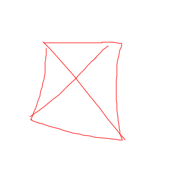

# Verzeichnis aller Standardalgorithmen
## Graphen
* [DFS](./Graphen/DFS.md) (Standard Graph Verarbeitung)
* [BFS](./Graphen/BFS.md) (Standard Graph Verarbeitung)
* [Topo Sort](./Graphen/TopoSort.md) (Graphen mit Abhängigkeiten sortieren)
* [Dijkstra](./Graphen/Dijkstra.md) (Shortest Path)
* [Kruskal](./Graphen/Kruskal.md) (Minimaler Spannbaum)
* [Prim](./Graphen/Prim.md) (Minimaler Spannbaum)
* [Union Find](./Graphen/UnionFind.md) (Effizientes Speichern von Graphen)

---

## Arrays
* [Binary Search](./Arrays/BinarySearch.md) (Element in sortierter Liste finden)
* [Prefixsum](./Arrays/prefixsum.md) (Summen von Teillisten berechnen)
* [Segmentbaum](./Arrays/Segmentbaum.md) (Einfache Funktionen über Unterliste einer Liste ausführen)

---

## Allgemeine Programmierung
* [Dynamic Programming](./AllgemeineProgrammierung/DynamicProgramming.md) (Zwischenspeichern / Lösungsansatz)

