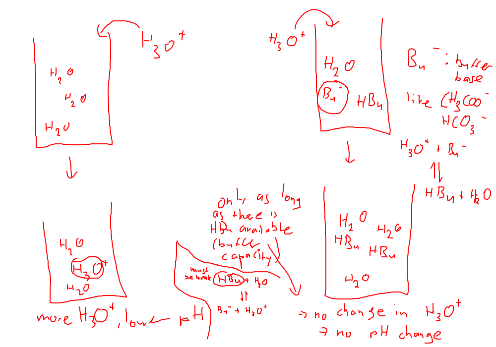

# Experiment

## Solution 1:
50 mL demin. water: pH = 7.5
+ 2 pipettes Coke: pH = 4.8
➔ Difference: 2.7

## Solution 2:
50 mL buffer Solution: pH = 4.4
+ 2 pipettes Coke: pH = 4.4
➔ Difference: 0

➔ **A buffer maintains a pH value.**

# Explanaiton
## Adding an acid

* works as long as there is enough HBu available
* and as long as we assure to choose a weak buffer acid (HBu)

## Adding a base
On unbuffered system:
OH- + H2= &lt;=&gt; H20 + OH-
➔ more OH- ➔ less H3O+

On a buffered system:
OH- + HBu &lt;=&gt; H20 + Bu-

➔ No change in pH as long as there is HBu available

## Text
		
	
	
		
			
				
					A buffer solution resists a change in *pH* when hydroxide ions (*OH-*) or hydronium ions (*H3O+*)
are added. There are two requirements for a buffer:
					1) Two components are needed: an acid capable of reacting with added *base* .
 a base capable of reacting with added *acid*
					2) The acid and the base must not *react with each other*.
These requirements mean a buffer is usually prepared from a conjugate *acid/base-pair* . 
				
			
		