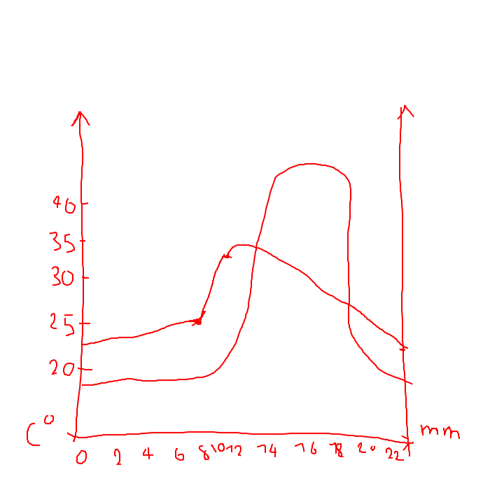

# 1
		
	
	
		
			
				
					Weather describes the short-term state of the atmosphere. It is a specific event or condition that happens
over a period of hours or **days**. For example, a thunderstorm and today’s temperature all
describe the weather. Weather is highly **variable** from day to day, and from one year to the next.
For example, we might have a warm winter one year and a much colder winter the next. This kind of
change is normal. But when the average pattern over many years changes, it could be a sign of climate
change.

**Climate** refers to the average weather conditions in a place over many years (usually at least 30
years, to account for the range of natural variations from one year to the next). It is the expected, rather
than the actual conditions. It is **long**-term and is often applied to sizeable parts of the globe, e.g.
the equatorial and the Mediterranean climates. 

# 2
* Position on globe
* Name of city
* Altitude
* Mean temperature / precipitation over year
* Mean temperature / precipitation each month

# 3
* Temerature is always more or less the same
* There is more rain in the beginning of the year.

# 4
* More temperature difference
* Seasons
* Change in rainfall by seasons
* Less overall rain
* Cooler

# 5

				
			
		