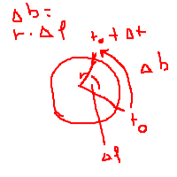

# Uniform Circular Motion
## Anglular Speed *w*
w = delta f / delta t
[w] = 1/s = rad/s

## Period
T = time taken / number of complete rotations
[T] = 1 s

### Conversion
w = delta f / delta t = 2 * pi / t

## Frequency
f = number of rotations / time taken
[f] = 1/s = Hz (Hertz)

### Conversion
f = 1/T
w = 2*pi / T = 2*pi*f

## Linear Speed
v = delta b / delta t
(circular arc / time taken)

v = circumference / period = 2 * pi * r / T = w * r
[v] = m/s

